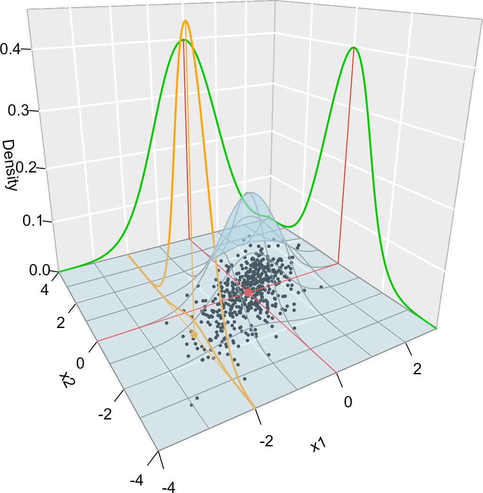

# Introduction {#intro}

<!--
(Move up once decided what options)
cover-image: no
description: "A subject within the MSc in Big Data Analytics at Carlos III University of Madrid (Spain)."
github-repo: egarpor/PM-UC3M
apple-touch-icon: "touch-icon.png"
apple-touch-icon-size: 120
favicon: "favicon.ico"
-->

```{block2, type = 'rmdcaution'}
The **animations** of these notes will not be displayed the first time they are browsed^[The reason is because they are hosted at `https` websites with auto-signed SSL certificates.]. See for example Figure \@ref(fig:leastsquares). **To see them**, click on the caption's link *"Application also available [here](https://ec2-35-177-34-200.eu-west-2.compute.amazonaws.com/least-squares/)"*. You will get a warning from your browser saying that *"Your connection is not private"*. Click in *"Advanced"* and **allow an exception** in your browser (I guarantee you I will not do anything evil!). The next time the animation will show up correctly within the notes.
```

## Course overview {#intro-course}

Welcome to the notes for *Predictive Modeling*. These notes contain both the theory and practice for the statistical methods presented in the course. The emphasis is placed in building intuition behind the methods, gaining insights into their properties, and showing their application through the use of statistical software. The topics we will cover are an in-depth analysis of **linear models** ([I](https://bookdown.org/egarpor/PM-UC3M/lm-i.html), [II](https://bookdown.org/egarpor/PM-UC3M/lm-ii.html), and [III](https://bookdown.org/egarpor/PM-UC3M/lm-iii.html)), their extension to
[**generalized linear models**](https://bookdown.org/egarpor/PM-UC3M/glm.html), and an introduction to [**nonparametric regression**](https://bookdown.org/egarpor/PM-UC3M/npreg.html).

The notes contain a substantial amount of snippets of code that are fully self-contained within the chapter in which they are included. This allows to see how the methods and theory translate neatly to the practice. The **software** employed in the course is *the* statistical language [`R`](https://cran.r-project.org/) and its most common IDE (Integrated Development Environment) nowadays, [`RStudio`](https://www.rstudio.com/products/rstudio/download/). A basic prior knowledge of both is assumed^[Among others: basic programming in `R`, ability to work with objects and data structures, ability to produce graphics, knowledge of the main statistical functions, and ability to run scripts in `RStudio`.]. The appendix presents some basic introductions to `RStudio` and `R` for those students lacking basic expertise on them.

The **Shiny interactive apps** on the notes can be downloaded and run locally, which allows in particular to examine their codes. Check [this GitHub repository](https://github.com/egarpor/ShinyServer) for the sources.

## Required packages {#intro-packages}

We will employ several packages that are not contained in `R` (*note: list to be updated*). These can be installed as:
```{r, echo = TRUE, cache = TRUE, warning = FALSE, message = FALSE, eval = FALSE}
# Installation of required packages
install.packages(c("car", "readxl", "rgl"))
#, "caret", "lars", "KernSmooth", "locfit"))
```

The codes in the notes may assume that the packages have been loaded, so it is better to do it now (*note: list to be updated*):
```{r, echo = TRUE, cache = TRUE, warning = FALSE, message = FALSE}
# Load packages
library(MASS)
library(car)
library(readxl)
library(rgl)
# library(caret)
# library(lars)
# library(KernSmooth)
# library(locfit)
```

<!--
## What is *predictive modeling*? {#intro-what-is}

The objective of predictive modeling is to make an accurate prediction.

> Predictive modeling is the process of developing a mathematical tool or model that generates an accurate prediction.

The process by which a model is created or chosen to try to best predict the probability of an outcome.

Prediction versus interpretability

black boxes.

statistical models with neat interpretations of the parameters.

correctness and usefulness


## The dangers of over-fitting {#intro-over-fitting}

App. Polynomial regression.

```{r, overfitting, echo = FALSE, fig.cap = 'Over-fitting illustration.', screenshot.alt = "images/screenshots/over-fitting.png", dev = 'png', cache = TRUE, fig.pos = 'h!', out.width = '90%'}
knitr::include_app('https://ec2-35-177-34-200.eu-west-2.compute.amazonaws.com/over-fitting/', height = '550px')
```

## Data splitting {#intro-data-splitting}

General strategy.

-->

## General notation and background {#intro-notation}

We use capital letters to denote *random variables*, such as $X$, and lowercase, such as $x$, to denote deterministic values. For example $\mathbb{P}[X=x]$ means ``the probability that the random variable $X$ takes the particular value $x$''. In predictive modelling we are concerned about the prediction or explanation of a *response* $Y$ from a set of *predictors* $X_1,\ldots,X_p$. Both $Y$ and $X_1,\ldots,X_p$ are random variables, but we use them in a different way: our interest lays in prediction or explaining $Y$ *from* $X_1,\ldots,X_p$. Other name for $Y$ is *dependent variable* and $X_1,\ldots,X_p$ are sometimes referred as *independent variables* or *explanatory variables*. We will not use these terminologies.

The *cumulative distribution function* (cdf) of a random variable $X$ is $F(x):=\mathbb{P}[X\leq x]$ and is a function that completely characterizes the randomness of $X$. Continuous random variables are also characterized by the *probability density function* (pdf) $f(x)=F'(x)$ (respectively, $F(x)=\int_{-\infty}^xf(t)\mathrm{d}t$), which represents the *infinitesimal relative probability* of $X$ per unit of length. On the other hand, discrete random variables are also characterized by the *probability mass function* $\mathbb{P}[X= x]$. We write $X\sim F$ (or $X\sim f$ if $X$ is continuous) to denote that $X$ has a cdf $F$ (or a pdf $f$). If two random variables $X$ and $Y$ have the same distribution, we write $X\stackrel{d}{=}Y$.

For a random variable $X\sim F$, the *expectation* of $g(X)$ is
\begin{align*}
\mathbb{E}[g(X)]:=&\,\int g(x)\mathrm{d}F(x)\\
:=&\,
\begin{cases}
\int g(x)f(x)\mathrm{d}x,&\text{ if }X\text{ is continuous,}\\\sum_{\{i:\mathbb{P}[X=x_i]>0\}} g(x_i)\mathbb{P}[X=x_i],&\text{ if }X\text{ is discrete.}
\end{cases}
\end{align*}
Unless otherwise stated, the integration limits of any integral are $\mathbb{R}$ or $\mathbb{R}^p$. The *variance* is defined as $\mathbb{V}\mathrm{ar}[X]:=\mathbb{E}[(X-\mathbb{E}[X])^2]$.

We employ boldface to denote vectors (assumed to be column matrices, although sometimes written in row-layout), like $\mathbf{a}$, and matrices, like $\mathbf{A}$. We denote by $\mathbf{A}'$ to the transpose of $\mathbf{A}$. Boldfaced capitals will be used simultaneously for denoting matrices and also *random vectors* $\mathbf{X}=(X_1,\ldots,X_p)$, which are collections random variables $X_1,\ldots,X_p$. The (joint) cdf of $\mathbf{X}$ is 
$$
F(\mathbf{x}):=\mathbb{P}[\mathbf{X}\leq \mathbf{x}]:=\mathbb{P}[X_1\leq x_1,\ldots,X_p\leq x_p]
$$
(understood as the probability that $X_1\leq x_1$ *and* $\ldots$ *and* $X_p\leq x_p$) and, if $\mathbf{X}$ is continuous, its (joint) pdf is $f:=\frac{\partial^p}{\partial x_1\cdots\partial x_p}F$. The *marginals* of $F$ and $f$ are the cdf and pdf of $X_j$, $j=1,\ldots,p$, respectively. They are defined as:
\begin{align*}
F_{X_j}(x_j)&:=\mathbb{P}[X_j\leq x]=\int_{\mathbb{R}^{p-1}} F(\mathbf{x})\mathrm{d}\mathbf{x}_{-i},\\
f_{X_j}(x_j)&:=\frac{\partial}{\partial x_j}F_{X_j}(x_j)=\int_{\mathbb{R}^{p-1}} f(\mathbf{x})\mathrm{d}\mathbf{x}_{-i},
\end{align*}
where $\mathbf{x}_{-i}:=(x_1,\ldots,x_{i-1},x_{i+1},x_p)$. The definitions can be extended analogously to the marginals of the cdf and pdf of different subsets of $\mathbf{X}$.

The *conditional* cdf and pdf of $X_1\vert(X_2,\ldots,X_p)$ are defined, respectively, as
\begin{align*}
F_{X_1\vert \mathbf{X}_{-1}=\mathbf{x}_{-1}}(x_1)&:=\mathbb{P}[X_1\leq x_1\vert \mathbf{X}_{-1}=\mathbf{x}_{-1}],\\
f_{X_1\vert \mathbf{X}_{-1}=\mathbf{x}_{-1}}(x_1)&:=\frac{f(\mathbf{x})}{f_{\mathbf{X}_{-1}}(\mathbf{x}_{-1})}.
\end{align*}
The *conditional expectation* of $Y\vert X$ is the following random variable^[Recall that the $X$-part is random!]
$$
\mathbb{E}[Y\vert X]:=\int y \mathrm{d}F_{Y\vert X}(y\vert X).
$$
The *$p$-dimensional normal* of mean $\boldsymbol{\mu}\in\mathbb{R}^p$ and covariance $\boldsymbol{\Sigma}$ (a $p\times p$ symmetric and positive definite matrix) is denoted by $\mathcal{N}_{p}(\boldsymbol{\mu},\boldsymbol{\Sigma})$ and is the generalization to $p$ random variables of usual the *normal* distribution. Its (joint) pdf is given by
$$
\phi(\mathbf{x};\boldsymbol{\mu},\boldsymbol{\Sigma}):=\frac{1}{(2\pi)^{p/2}|\boldsymbol{\Sigma}|^{1/2}}e^{-\frac{1}{2}(\mathbf{x}-\boldsymbol{\mu})'\boldsymbol{\Sigma}^{-1}(\mathbf{x}-\boldsymbol{\mu})},\quad \mathbf{x}\in\mathbb{R}^p.
$$
Notice that when $p=1$, and $\boldsymbol{\mu}=\mu$ and $\boldsymbol{\Sigma}=\sigma^2$, then the pdf of the usual normal is recovered: $\phi(x;\mu,\sigma):=\frac{1}{\sqrt{2\pi}\sigma}e^{-\frac{(x-\mu)^2}{2\sigma^2}}$. When $p=2$, the pdf is expressed in terms of $\boldsymbol{\mu}=(\mu_1,\mu_2)$ and $\boldsymbol{\Sigma}=(\sigma_1^2,\rho\sigma_1\sigma_2;\rho\sigma_1\sigma_2,\sigma_2^2)$, for $\mu_1,\mu_2\in\mathbb{R}$, $\sigma_1,\sigma_2>0$, and $-1<\rho<1$:
\begin{align}
\phi(x_1,x_2;\mu_1,\mu_2,\sigma_1,\sigma_2,\rho):=\frac{1}{2\pi\sigma_1\sigma_1\sqrt{1-\rho^2}}e^{-\frac{1}{2(1-\rho^2)}\left[\frac{(x_1-\mu_1)^2}{\sigma_1^2}+\frac{(x_2-\mu_2)^2}{\sigma_2^2}-\frac{2\rho(x_1-\mu_1)(x_2-\mu_2)}{\sigma_1\sigma_2}\right]}.(\#eq:norm2)
\end{align}
The surface defined by \@ref(eq:norm2) that can be regarded as a bell (in three dimensions). In addition, it serves to provide concrete examples of the functions introduced above:

- Joint pdf: $f(x_1,x_2)=\phi(x_1,x_2;\mu_1,\mu_2,\sigma_1,\sigma_2,\rho)$.
- Marginal pdfs: $f_{X_1}(x_1)=\int \phi(x_1,t_2;\mu_1,\mu_2,\sigma_1,\sigma_2,\rho)\mathrm{d}t_2=\phi(x_1;\mu_1,\sigma_1)$ and $\phi(x_2;\mu_2,\sigma_2)$. Hence $X_1\sim\mathcal{N}(\mu_1,\sigma_1)$ and $X_2\sim\mathcal{N}(\mu_2,\sigma_2)$.
- Conditional pdfs: $f_{X_1\vert X_2=x_2}(x_1)=\frac{f(x_1,x_2)}{f_{X_2}(x_2)}=\phi\left(x_1;\mu_1+\rho\frac{\sigma_1}{\sigma_2}(x_2-\mu_2),(1-\rho^2)\sigma_1^2\right)$ and $\phi\left(x_2;\mu_2+\rho\frac{\sigma_2}{\sigma_1}(x_1-\mu_1),(1-\rho^2)\sigma_2^2\right)$. Hence 
\begin{align*}
X_1&\vert X_2=x_2\sim\mathcal{N}\left(\mu_1+\rho\frac{\sigma_1}{\sigma_2}(x_2-\mu_2),(1-\rho^2)\sigma_1^2\right),\\
X_2&\vert X_1=x_1\sim\mathcal{N}\left(\mu_2+\rho\frac{\sigma_2}{\sigma_1}(x_1-\mu_1),(1-\rho^2)\sigma_2^2\right).
\end{align*}
- Conditional expectations: $\mathbb{E}[X_1|X_2=x_2]=\mu_1+\rho\frac{\sigma_1}{\sigma_2}(x_2-\mu_2)$ and $\mathbb{E}[X_2|X_1=x_1]=\mu_2+\rho\frac{\sigma_2}{\sigma_1}(x_1-\mu_1)$.
- Joint cdf: $\int_{-\infty}^{x_2}\int_{-\infty}^{x_1}\phi(t_1,t_2;\mu_1,\mu_2,\sigma_1,\sigma_2,\rho)\mathrm{d}t_1\mathrm{d}t_2$.
- Marginal cdfs: $\int_{-\infty}^{x_1}\phi(t;\mu_1,\sigma_1)\mathrm{d}t=:\Phi(x_1;\mu_1,\sigma_1)$ and $\Phi(x_2;\mu_2,\sigma_2)$.
- Conditional cdfs: $\int_{-\infty}^{x_1}\phi(t;\mu_1,\sigma_1)\mathrm{d}t=\Phi\left(x_1;\mu_1+\rho\frac{\sigma_1}{\sigma_2}(x_2-\mu_2),(1-\rho^2)\sigma_1^2\right)$ and $\Phi\left(x_2;\mu_2+\rho\frac{\sigma_2}{\sigma_1}(x_1-\mu_1),(1-\rho^2)\sigma_2^2\right)$.

(ref:norm2title) Visualization of the joint pdf (in blue), marginal pdfs (green), conditional pdf of $X_2\vert X_1=x_1$ (orange), expectation (red point), and conditional expectation $\mathbb{E}[X_2\vert X_1=x_1]$ (orange point) of a $2$-dimensional normal. The conditioning point of $X_1$ is $x_1=-2$. Note the different scales of the densities, as they have to integrate one over different supports. Note how the conditional density (upper orange curve) is *not* the joint pdf $f(2,x_2)$ (lower orange curve) but a rescaling of this curve by $\frac{1}{f_{X_1}(x_1)}$. The parameters of the $2$-dimensional normal are $\mu_1=\mu_2=0$, $\sigma_1=\sigma_2=1$ and $\rho=0.75$. $500$ observations sampled from the distribution are shown in black.

```{r, norm2, echo = FALSE, out.width = '70%', fig.pos = 'h!', fig.cap = '(ref:norm2title)', cache = TRUE}

```

In the predictive models we will consider an *independent and identically distributed* (iid) sample of the response and the predictors. We use the following notation: $Y_i$ is the $i$-th observation of the response $Y$ and $X_{ij}$ represents the $i$-th observation of the $j$-th predictor $X_j$.

## Datasets for the course {#intro-datasets}

This is a (constantly updated) handy list of all the relevant datasets used in the course. To download them, simply **save the link as a file** in your browser.

- `wine.csv` ([download](https://raw.githubusercontent.com/egarpor/PM-UC3M/master/datasets/wine.csv)). The dataset is formed by the auction `Price` of 27 red Bordeaux vintages, five vintage descriptors (`WinterRain`, `AGST`, `HarvestRain`, `Age`, `Year`), and the population of France in the year of the vintage, `FrancePop`.

- `least-squares.RData` ([download](https://raw.githubusercontent.com/egarpor/PM-UC3M/master/datasets/least-squares.RData)). Contains a single `data.frame`, named `leastSquares`, with 50 observations of the variables `x`, `yLin`, `yQua`, and `yExp`. These are generated as $X\sim\mathcal{N}(0,1)$, $Y_\mathrm{lin}=-0.5+1.5X+\varepsilon$, $Y_\mathrm{qua}=-0.5+1.5X^2+\varepsilon$, and $Y_\mathrm{exp}=-0.5+1.5\cdot2^X+\varepsilon$, with $\varepsilon\sim\mathcal{N}(0,0.5^2)$. The purpose of the dataset is to illustrate the least squares fitting.

- `least-squares-3D.RData` ([download](https://raw.githubusercontent.com/egarpor/PM-UC3M/master/datasets/least-squares-3D.RData)). Contains a single `data.frame`, named `leastSquares3D`, with 50 observations of the variables `x1`, `x2`, `x3`, `yLin`, `yQua`, and `yExp`. These are generated as $X_1,X_2\sim\mathcal{N}(0,1)$, $X_3=X_1+\mathcal{N}(0,0.05^2)$, $Y_\mathrm{lin}=-0.5 + 0.5 X_1 + 0.5 X_2 +\varepsilon$, $Y_\mathrm{qua}=-0.5 + X_1^2 + 0.5 X_2+\varepsilon$, and $Y_\mathrm{exp}=-0.5 + 0.5 e^{X_2} + X_3+\varepsilon$, with $\varepsilon\sim\mathcal{N}(0,1)$. The purpose of the dataset is to illustrate the least squares fitting with several predictors.

- `assumptions.RData` ([download](https://raw.githubusercontent.com/egarpor/PM-UC3M/master/datasets/assumptions.RData)). Contains the data frame `assumptions` with 200 observations of the variables `x1`, ..., `x9` and `y1`, ..., `y9`. The purpose of the dataset is to identify which regression `y1 ~ x1`, ..., `y9 ~ x9` fulfills the assumptions of the linear model. The dataset `moreAssumptions.RData` ([download](https://raw.githubusercontent.com/egarpor/PM-UC3M/master/datasets/moreAssumptions.RData)) has the same structure.

- `assumptions3D.RData` ([download](https://raw.githubusercontent.com/egarpor/PM-UC3M/master/datasets/assumptions3D.RData)). Contains the data frame `assumptions3D` with 200 observations of the variables `x1.1`, ..., `x1.8`, `x2.1`, ..., `x2.8` and `y.1`, ..., `y.8`. The purpose of the dataset is to identify which regression `y.1 ~ x1.1 + x2.1`, ..., `y.8 ~ x1.8 + x2.8` fulfills the assumptions of the linear model.

- `Boston.xlsx` ([download](https://raw.githubusercontent.com/egarpor/PM-UC3M/master/datasets/Boston.xlsx)). The dataset contains 14 variables describing 506 suburbs in Boston. Among those variables, `medv` is the median house value, `rm` is the average number of rooms per house and `crim` is the per capita crime rate. The full description is available in `?Boston`.

- `cpus.txt` ([download](https://raw.githubusercontent.com/egarpor/PM-UC3M/master/datasets/cpus.txt)) and `gpus.txt` ([download](https://raw.githubusercontent.com/egarpor/PM-UC3M/master/datasets/gpus.txt)). The datasets contain 102 and 35 rows, respectively, of commercial CPUs and GPUs appeared since the first models up to nowadays. The variables in the datasets are `Processor`, `Transistor count`, `Date of introduction`, `Manufacturer`, `Process`, and `Area`.

<!-- - `la-liga-2015-2016.xlsx` ([download](https://raw.githubusercontent.com/egarpor/PM-UC3M/master/datasets/la-liga-2015-2016.xlsx)). Contains 19 performance metrics for the 20 football teams in La Liga 2015/2016. -->

<!-- - `challenger.txt` ([download](https://raw.githubusercontent.com/egarpor/PM-UC3M/master/datasets/challenger.txt)). Contains data for 23 Space-Shuttle launches. The data consists of 23 shuttle flights. There are 8 variables. Among them: `temp` (the temperature in Celsius degrees at the time of launch), and `fail.field` and `fail.nozzle` (indicators of whether there were an incidents in the O-rings of the field joints and nozzles of the solid rocket boosters). -->

<!-- - `Chile.txt` ([download](https://raw.githubusercontent.com/egarpor/PM-UC3M/master/datasets/Chile.txt)). Contains data for 2700 respondents on a survey for the voting intentions in the 1988 Chilean national plebiscite. There are 8 variables: `region`, `population`, `sex`, `age`, `education`, `income`, `statusquo` (scale of support for the status quo), and `vote`. `vote` is a factor with levels `A` (abstention), `N` (against Pinochet), `U` (undecided), and `Y` (for Pinochet). Available in `R` through the package `car` and `data(Chile)`. -->

## Main references and credits {#intro-credits}

Several great reference books have been used for preparing these notes. The following list details the sections in which each of them has been consulted (*note: list to be updated*):

- @Kuhn2013 <!-- (Sections \@ref(intro-data-splitting), \@ref(intro-what-is)) -->
- @James2013 <!-- (Sections \@ref(lm-i-model) - \@ref(lm-i-modfit), \@ref(lm-ii-lab-boston)) -->
- @Fan1996 <!-- (Sections \@ref(reg-kre), \@ref(reg-asymp), \@ref(reg-bwd)). -->
- @Pena2002 <!--(Sections \@ref(lm-i-model) - \@ref(lm-i-modfit)) -->
- @Loader1999 <!-- (Section \@ref(reg-loclik)). -->
- @Wand1995 <!-- (Sections \@ref(reg-loclik)). -->
- @Wasserman2004 <!-- (Sections \@ref(reg-param), \@ref(reg-loclik)). -->
- @Wasserman2006 <!-- (Sections \@ref(reg-bwd)). -->

In addition, these notes are possible due to the existence of these incredible pieces of software: @R-bookdown, @R-knitr, @R-rmarkdown, and @R-base.

The icons used in the notes were designed by [madebyoliver](http://www.flaticon.com/authors/madebyoliver), [freepik](http://www.flaticon.com/authors/freepik), and [roundicons](http://www.flaticon.com/authors/roundicons) from [Flaticon](http://www.flaticon.com/).

All material in these notes is licensed under [CC BY-NC-SA 4.0](https://creativecommons.org/licenses/by-nc-sa/4.0/).
